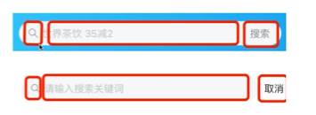
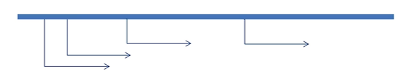

# FingertipAllianceFrontEnd

## 技术栈

TypeScript + Vite + Vue3 + Pinia + Axios + Vant4 + NodeJs + Mock Server + Json-server

## 编译工具 VsCode

1.首先有时候使用新建一个 TypeScript 的项目之后, 很容易会出现项目中某某模块未找到的错误, 或者语法提示十分差劲, 这个时候, 可以尝试通过去降低 Vue-Office 这个插件的版本来解决。

2.设置".Vue"文件的快速生成的代码模板

方法：点击右下脚的设置, 然后选择用户代码片段, 在头部输入框输入 vue, 进入设置页面后, 便可以进行你自己代码片段的定制了

```json
"vue3": {
    "prefix": "vue3",
    "body": [
        "<template>",
        "  <div class=\"\">",
        "",
        "  </div>",
        "</template>",
        "<script setup lang=\"ts\">",
        "import { ref, reactive } from \"vue"\"",
        "",
        "</script>",
        "<style lang=\"scss\" scoped>",
        "",
        "<style>",
        "",
        "</style>",
        ""
    ],
    "description": "快速创建Vue3模板"
}
```

## 技术点

### normalize.scss 处理不同浏览器的默认样式

### sass: CSS 预处理器

### Vant 组件库按需加载

1.安装依赖:

```bash
 cnpm i @vant/auto-import-resolver unplugin-vue-components unplugin-auto-import -D
```

2.插件配置

```ts
import vue from "@vitejs/plugin-vue";
import AutoImport from "unplugin-auto-import/vite";
import Components from "unplugin-vue-components/vite";
import { VantResolver } from "@vant/auto-import-resolver";

export default {
  plugins: [
    vue(),
    AutoImport({
      resolvers: [VantResolver()],
    }),
    Components({
      resolvers: [VantResolver()],
    }),
  ],
};
```

### H5 项目的适配方案

#### rem 布局

如果需要使用 rem 单位进行适配，常常使用 postcss-pxtorem 或 lib-flexible 两个方案

postcss-pxtorem 是一款 PostCSS 插件，用于将 px 单位转化为 rem 单位

> postcss-pxtorem 已有 4 年没有更新，因此它是不支持 PostCSS 8.0+ 版本的（PostCss 8.0+ 以上的版本是主流，也是未来的方向），因此不推荐使用该方案

lib-flexible 用于设置 rem 基准值

访问 lib-flexible 的 github 仓库，文档中有这么一段话

> 由于 viewport 单位得到众多浏览器的兼容，lib-flexible 这个过渡方案已经可以放弃使用，不管是现在的版本还是以前的版本，都存有一定的问题。建议大家开始使用 viewport 来替代此方案。因此不推荐使用该方案

#### Viewport 布局

Vant 默认使用 px 作为样式单位(很多 UI 框架都是默认 px)，如果需要使用 viewport 单位 (vw, vh, vmin, vmax)，推荐使用 postcss-px-to-viewport 进行转换。

postcss-px-to-viewport 是一款 PostCSS 插件，用于将 px 单位转化为 vw/vh 单位。

安装插件

```bash
npm install postcss postcss-loader postcss-px-to-viewport-8-plugin -D
```

配置 vite.config.ts

```ts
import { defineConfig, loadEnv } from "vite";
import vue from "@vitejs/plugin-vue";
// 自动导入vue中hook reactive ref等
import AutoImport from "unplugin-auto-import/vite";
// 自动导入ui 组件
import Components from "unplugin-vue-components/vite";
// Vant 官方基于 unplugin-vue-components 提供的自动导入样式的解析器
import { VantResolver } from "@vant/auto-import-resolver";
// 这个path 需要安装的 @types/node
import path from "path";
// postcss8 插件
import postcsspxtoviewport8plugin from "postcss-px-to-viewport-8-plugin";

// https://vitejs.dev/config/
export default defineConfig(({ command, mode }) => {
  // 根据当前工作目录中的 `模式` 加载 .env 文件
  // 设置第三个参数为 '' 来加载所有环境变量，而不管是否有 `VITE_` 前缀。
  // 设置第三个参数为 'VITE_' 表示加载'VITE_'开头的环境变量
  const env = loadEnv(mode, process.cwd(), "VITE_");
  console.log(env);
  const port: number = (env.VITE_APP_PORT as any) || 80;
  return {
    // 应用访问路径 例如使用前缀 /admin/
    base: env.VITE_APP_CONTEXT_PATH,
    plugins: [
      vue(),
      AutoImport({
        // 安装两行后你会发现在组件中不用再导入ref，reactive等
        imports: ["vue", "vue-router"],
        // 存放的位置
        dts: "src/auto-import.d.ts",
      }),
      Components({
        // 存放的位置: 引入组件的,包括自定义组件
        dts: "src/components.d.ts",
        resolvers: [VantResolver()],
      }),
    ],
    // 配置别名
    resolve: {
      // https://cn.vitejs.dev/config/shared-options.html#resolve-alias
      alias: {
        // "~": path.resolve(__dirname, "./"), // ~代替./
        "@": path.resolve("./src"), // @代替src
      },
    },
    // https://cn.vitejs.dev/config/server-options
    server: {
      // 将此设置为 0.0.0.0 或者 true 将监听所有地址，包括局域网和公网地址
      host: true,
      // 配置启动并端口号
      // 注意：如果端口已经被使用，Vite 会自动尝试下一个可用的端口，所以这可能不是开发服务器最终监听的实际端口
      port: Number(port),
      // 服务启动时是否自动打开浏览器
      open: true,
      // 代理配置
      proxy: {
        [env.VITE_APP_BASE_API]: {
          // 要代理的服务器地址
          target: env.VITE_PROXY_TARGET_URL,
          // 允许跨域,可以代理反向的地址
          changeOrigin: true,
          // 将代理前缀替换为空
          // 如：http://xxx.com/dev-api/login  替换成 -> http://xxx.com/login
          rewrite: (path) =>
            path.replace(new RegExp("^" + env.VITE_APP_BASE_API), ""),
        },
      },
    },
    css: {
      // 适配移动端
      postcss: {
        plugins: [
          postcsspxtoviewport8plugin({
            unitToConvert: "px", // 需要转换的单位，默认为 px
            viewportWidth: 375, // UI设计稿的视口宽度
            unitPrecision: 5, // 单位转换后保留的精度
            propList: ["*"], // 能转化为vw的属性列表
            viewportUnit: "vw", // 希望使用的视口单位
            fontViewportUnit: "vw", // 字体使用的视口单位
            selectorBlackList: [], // 需要忽略的CSS选择器，不会转为视口单位，使用原有的px等单位。
            minPixelValue: 1, // 设置最小的转换数值，如果为1的话，只有大于1的值会被转换
            mediaQuery: true, // 媒体查询里的单位是否需要转换单位
            replace: true, //  是否直接更换属性值，而不添加备用属性
            exclude: [/node_modules/], // 忽略某些文件夹下的文件或特定文件，例如 'node_modules' 下的文件
            include: [], // 如果设置了include，那将只有匹配到的文件才会被转换
            landscape: false, // 是否添加根据 landscapeWidth 生成的媒体查询条件 @media (orientation: landscape)
            landscapeUnit: "vw", // 横屏时使用的单位
            landscapeWidth: 1024, // 横屏时使用的视口宽度
          }),
        ],
      },
    },
  };
```

案例：

```html
<template>
  <!-- 适配生效 -->
  <div class="div1">div1</div>
  <!-- 适配不生效：写在style里面的则不能转换，插件不支持这种方式 -->
  <div style="width: 185px; height: 50px; background-color: blue">div2</div>
</template>

<script setup lang="ts"></script>

<style>
  .div1 {
    width: 185px;
    height: 50px;
    background-color: red;
  }
</style>
```

虽然 postcss-px-to-viewport-8-plugin 做适配，但是行内样式不能转换为 vw，所以我们自定义个插件，将内样式 px 转成 vw

创建文件 src/plugin/vite-plugin-style-vw-loader.ts, 内容为：

```ts
// 虽然postcss-px-to-viewport-8-plugin做适配，但是行内样式不能转换为vw，所以我们自定义个插件，将内样式px转成vw
interface IdefaultsProp {
  unitToConvert: string;
  viewportWidth: number;
  unitPrecision: number;
  viewportUnit: string;
  fontViewportUnit: string;
  minPixelValue: number;
}

// 默认参数
const defaultsProp: IdefaultsProp = {
  unitToConvert: "px", // 需要转换的单位，默认为"px"
  viewportWidth: 375, // 设计稿的视口宽度,如传入函数，函数的参数为当前处理的文件路径
  unitPrecision: 5, // 单位转换后保留的精度
  viewportUnit: "vw", // 希望使用的视口单位
  fontViewportUnit: "vw", // 字体使用的视口单位
  minPixelValue: 1, // 设置最小的转换数值，如果为 1 的话，只有大于 1 的值会被转换
};
function toFixed(number: number, precision: number) {
  const multiplier = Math.pow(10, precision + 1),
    wholeNumber = Math.floor(number * multiplier);
  return (Math.round(wholeNumber / 10) * 10) / multiplier;
}

function createPxReplace(viewportSize: number, minPixelValue: number, unitPrecision: number, viewportUnit: any) {
  return function ($0: any, $1: any) {
    if (!$1) return;
    const pixels = parseFloat($1);
    if (pixels <= minPixelValue) return;
    return toFixed((pixels / viewportSize) * 100, unitPrecision) + viewportUnit;
  };
}
const templateReg: RegExp = /([\s\S]+)/gi;
const pxGlobalReg: RegExp = /(\d+)px/gi;

function vitePluginStyleVWLoader(customOptions: IdefaultsProp = defaultsProp) {
  return {
    // 插件名称
    name: "vite-plugin-style-vw-loader",
    // 构建阶段的通用钩子：在每个传入模块请求时被调用：在每个传入模块请求时被调用，主要是用来转换单个模块
    transform(code: any, id: any) {
      customOptions = Object.assign(defaultsProp, customOptions);
      if (/.vue$/.test(id)) {
        let _source = "";
        if (templateReg.test(code)) {
          _source = code.match(templateReg)[0];
        }
        if (pxGlobalReg.test(_source)) {
          const $_source = _source.replace(pxGlobalReg, createPxReplace(customOptions.viewportWidth, customOptions.minPixelValue, customOptions.unitPrecision, customOptions.viewportUnit));

          code = code.replace(_source, $_source);
        }
      }
      return { code };
    },
  };
}
export default vitePluginStyleVWLoader;
```

修改 tsconfig.node.json 配置为:

```json
{
  "compilerOptions": {
    "composite": true,
    "skipLibCheck": true,
    "module": "ESNext",
    "moduleResolution": "bundler",
    "allowSyntheticDefaultImports": true
  },
  // 这里加载自定义的插件 ts
  "include": ["vite.config.ts", "src/plugin/vite-plugin-style-vw-loader.ts"]
}
```

修改 vite.config.ts 配置为如下：

```ts
import { defineConfig, loadEnv } from "vite";
import vue from "@vitejs/plugin-vue";
// 自动导入vue中hook reactive ref等
import AutoImport from "unplugin-auto-import/vite";
// 自动导入ui 组件
import Components from "unplugin-vue-components/vite";
// Vant 官方基于 unplugin-vue-components 提供的自动导入样式的解析器
import { VantResolver } from "@vant/auto-import-resolver";
// 这个path 需要安装的 @types/node
import path from "path";
// postcss8 插件
import postcsspxtoviewport8plugin from "postcss-px-to-viewport-8-plugin";
// 虽然postcss-px-to-viewport-8-plugin做适配，但是行内样式不能转换为vw，所以我们自定义个插件，将内样式px转成vw
import vitePluginStyleVwLoader from "./src/plugin/vite-plugin-style-vw-loader";

// https://vitejs.dev/config/
export default defineConfig(({ command, mode }) => {
  // 根据当前工作目录中的 `模式` 加载 .env 文件
  // 设置第三个参数为 '' 来加载所有环境变量，而不管是否有 `VITE_` 前缀。
  // 设置第三个参数为 'VITE_' 表示加载'VITE_'开头的环境变量
  const env = loadEnv(mode, process.cwd(), "VITE_");
  console.log(env);
  const port: number = (env.VITE_APP_PORT as any) || 80;
  return {
    // 应用访问路径 例如使用前缀 /admin/
    base: env.VITE_APP_CONTEXT_PATH,
    plugins: [
      // 该插件需要放在vue()之前
      vitePluginStyleVwLoader({
        unitToConvert: "px",
        viewportWidth: 375,
        unitPrecision: 5,
        viewportUnit: "vw",
        fontViewportUnit: "vw",
        minPixelValue: 1,
      }),
      AutoImport({
        // 全局引入插件
        // 安装两行后你会发现在组件中不用再导入ref，reactive等
        imports: ["vue", "vue-router"],
        // 存放的位置
        dts: "src/auto-import.d.ts",
      }),
      // 全局注册组件
      Components({
        // 默认自动导入的目录是： dirs: ['src/components']
        dirs: ["src/components"],
        // 存放的位置: 引入组件的,包括自定义组件
        dts: "src/components.d.ts",
        resolvers: [VantResolver()],
      }),
      vue(),
    ],
    // 配置别名
    resolve: {
      // https://cn.vitejs.dev/config/shared-options.html#resolve-alias
      alias: {
        // "~": path.resolve(__dirname, "./"), // ~代替./
        "@": path.resolve("./src"), // @代替src
      },
    },
    // https://cn.vitejs.dev/config/server-options
    server: {
      // 将此设置为 0.0.0.0 或者 true 将监听所有地址，包括局域网和公网地址
      host: true,
      // 配置启动并端口号
      // 注意：如果端口已经被使用，Vite 会自动尝试下一个可用的端口，所以这可能不是开发服务器最终监听的实际端口
      port: Number(port),
      // 服务启动时是否自动打开浏览器
      open: true,
      // 代理配置
      proxy: {
        [env.VITE_APP_BASE_API]: {
          // 要代理的服务器地址
          target: env.VITE_PROXY_TARGET_URL,
          // 允许跨域,可以代理反向的地址
          changeOrigin: true,
          // 将代理前缀替换为空
          // 如：http://xxx.com/dev-api/login  替换成 -> http://xxx.com/login
          rewrite: (path) => path.replace(new RegExp("^" + env.VITE_APP_BASE_API), ""),
        },
      },
    },
    css: {
      // 适配移动端
      postcss: {
        plugins: [
          postcsspxtoviewport8plugin({
            unitToConvert: "px",
            viewportWidth: 375,
            unitPrecision: 5, // 单位转换后保留的精度
            propList: ["*"], // 能转化为vw的属性列表
            viewportUnit: "vw", // 希望使用的视口单位
            fontViewportUnit: "vw", // 字体使用的视口单位
            selectorBlackList: [], // 需要忽略的CSS选择器，不会转为视口单位，使用原有的px等单位。
            minPixelValue: 1, // 设置最小的转换数值，如果为1的话，只有大于1的值会被转换
            mediaQuery: true, // 媒体查询里的单位是否需要转换单位
            replace: true, //  是否直接更换属性值，而不添加备用属性
            exclude: [], // 忽略某些文件夹下的文件或特定文件，例如 'node_modules' 下的文件
            include: [], // 如果设置了include，那将只有匹配到的文件才会被转换
            landscape: false, // 是否添加根据 landscapeWidth 生成的媒体查询条件 @media (orientation: landscape)
            landscapeUnit: "vw", // 横屏时使用的单位
            landscapeWidth: 1024, // 横屏时使用的视口宽度
          }),
        ],
      },
    },
  };
});
```

### 状态管理方案

### Mock Server 支持后台服务

### Vite 的特性

### 使用 Vite 配置请求代理（反向代理）

### 前后端联调工具 axios

### 项目业务组件

#### 业务组件之 SearchView

##### 需求分析

- 展示切换动画
- 搜索框输入文字, 自动发送请求
- 搜索结果展示
- 搜索状态维护
- 历史搜索展示, 点击历史搜索后发送请求
- 历史搜索更多切换动画

### 项目基础组件

- 如何设计一个组件
- 使用 defineEmits 定义组件的事件
- 如何定义组件的 V-model
- 如何使用 CSS 变量
- BEM 命名规范

#### BEM 命名规范

Bem 是块（block） 、元素（element）、修饰符（modifier）的简写

- `-`中划线: 仅作为连字符使用，表示某个块或者某个子元素的多单词之间的连接记号
- `__`双下划线: 双下划线用来连接块和块的子元素
- `--`双中划线: 双中划线用来描述一个块或者块的子元素的一种状态

#### 基础组件之 Search 搜索框



##### 布局

```bash
+ content
  - left-icon
  - body
    - input-control
    - right-icon
```

##### 功能分析

| 功能                                                                  | 属性          | 事件                | slot         |
| --------------------------------------------------------------------- | ------------- | ------------------- | ------------ |
| 自定义背景色                                                          | `background`  |                     |              |
| 自定义 `placeholder`                                                  | `placeholder` |                     |              |
| 自定义形状                                                            | `shape`       |                     |              |
| 自定义是否展示 `action`                                               | `shownAction` |                     |              |
| 设置搜索框的值 `value`                                                | `v-model`     | `update:modelValue` |              |
| 按回车搜索                                                            |               | `search`            |              |
| 点击“取消”按钮触发取消事件                                            |               | `cancel`            |              |
| 如果不存在 `right-icon`, 输入内容时会出现`“x”`, 点击`“x”`可以清空内容 |               | `clear`             |              |
| 设置 `right-icon`                                                     |               |                     | `right-icon` |

#### 基础组件之LoadingView实现骨架屏

##### 功能分析

| 功能      | 属性                         | slot     |
|---------|----------------------------|----------|
|加载状态|loading||
| 加载提示类型  | type 取值 `loading`、`skeleton` |          |
| 自定义加载提示 |                            | template |
### 项目自定义 Hooks

### 项目所使用的插件的文档

### 项目性能优化

#### 性能优化: useDebounce避免多次请求

发现问题: 当用户在输入框只要输入文字的过程中就会不断去发送网络请求

- 短时间内多次发送请求, 造成返回结果的不正确
- 发送无用请求, 占用服务器资源

理解问题: 什么是抖动问题呢?



如何解决抖动问题: 在一段时间内触发多次, 只执行最后一次

- 将事件延时执行（setTimeout）
- 如果在这段时间内事件再被触发, 则取消执行之前的事件（使用变量标记触发状态, clearTimeout来进行取消）

